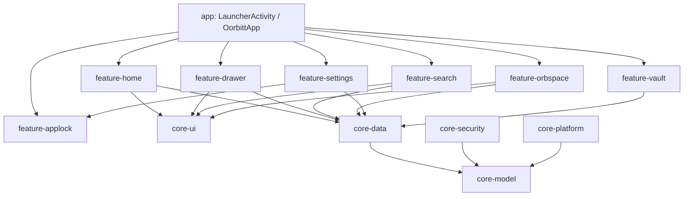

# oorbE (Oorbitt Launcher)

An enterprise-grade, modular Android home launcher built with Kotlin and Jetpack Compose. Engineered with strict isolation across 17 feature and core modules, privileged Shizuku IPC system bindings, hardware-backed biometric security vaults, and unidirectional reactive state streams.

---

## Architectural Highlights

- **17-Module Clean Architecture**: Clear segregation between pure domain models (`core-model`), persistence (`core-data`), security engines (`core-security`), platform bindings (`core-platform`), and independent feature modules.
- **Privileged System Control (Shizuku IPC)**: Deep system-level integrations via Shizuku binder IPC for advanced device state and package management.
- **Hardware-Backed Biometric Vault**: AndroidX `BiometricPrompt` integration coupled with AES-256 encrypted storage (`KeyStore`) for app locking and private memo vaults.
- **Declarative UI & Theming**: Built 100% in **Jetpack Compose** with custom shape rendering, Catppuccin Mocha palettes, and dynamic icon pack transformation pipelines.
- **Reactive State Flow**: Strict unidirectional data flow (UDF) powered by Kotlin Coroutines, `StateFlow`, and Koin dependency injection.

---

## Module Dependency Graph



---

## Module Index

| Module | Scope / Responsibility |
| :--- | :--- |
| **`core-model`** | Pure domain entities, preference models, and feature flags. Zero Android dependencies. |
| **`core-data`** | Room database persistence, DataStore preferences, and repository Flow interfaces. |
| **`core-security`** | Hardware-backed Biometric prompt wrappers, KeyStore encryption, and mindful focus locks. |
| **`core-platform`** | Device policy bindings, package manager queries, and system event receivers. |
| **`core-ui`** | Reusable Compose design system, Catppuccin color ramps, shape generators, and icon transforms. |
| **`feature-shizuku`** | Elevated IPC interface communicating with the Shizuku system daemon. |
| **`feature-vault`** | Biometric-authenticated private space for hidden applications and encrypted notes. |
| **`feature-applock`** | Foreground app monitoring with PIN/pattern/biometric gating. |
| **`feature-home`** | Primary workspace grid, gesture detection, and interactive widget canvas. |
| **`feature-drawer`** | High-performance app indexing, search prioritization, and category categorization. |
| **`feature-stylehub`** | Dynamic theme and setup repository with fallback mock support. |
| **`feature-wellness`** | Scroll budgets, app usage timeouts, and digital friction prompts. |

---

## Tech Stack

- **Language**: Kotlin 2.x
- **UI Toolkit**: Jetpack Compose + Compose Foundation
- **Dependency Injection**: Koin
- **Asynchronous Engine**: Kotlin Coroutines & StateFlow
- **Local Persistence**: Room SQLite (Entity Caching) + AndroidX DataStore
- **Security**: AndroidX Biometric + Android Keystore Provider (AES-GCM)
- **System Integration**: Shizuku IPC API

---

## Building from Source

1. Clone repository:
   ```bash
   git clone https://github.com/farhatkoka/oorbe.git
   cd oorbe
   ```
2. Open in **Android Studio Hedgehog / Jellyfish** or build via Gradle wrapper:
   ```bash
   ./gradlew assembleDebug
   ```

---

## Author & License

- **Author**: Farhat Iqbal ([farhatiqbal.in](https://farhatiqbal.in))
- **License**: MIT
