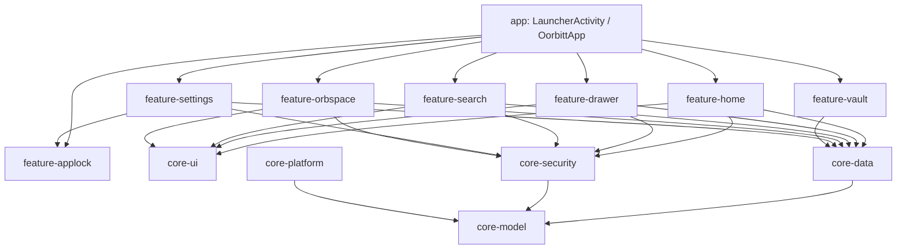

# Oorbitt Launcher (oorbE) - Comprehensive Architecture & Features Report

Oorbitt Launcher is a highly customizable, privacy-oriented, and digital wellness-focused Android launcher. Built using Kotlin, Jetpack Compose, and modern Android development libraries (Room, Datastore, Koin, Coroutines, Flow), it offers advanced control over interface aesthetics, secure biometric app vaults, gesture-triggered commands, and scrolling limits to curb social media addiction.

---

## 1. Project Architecture & Module Structure

The launcher follows a modular clean architecture designed to isolate concerns, maintain speed, and compile efficiently.



### Module Breakdown

*   **[app](file:///home/pocketpc/Projects/oorbE/app)**: Entry point of the launcher.
    *   Initialize dependency injection (Koin) inside [OorbittApp.kt](file:///home/pocketpc/Projects/oorbE/app/src/main/kotlin/com/oorbitt/launcher/OorbittApp.kt).
    *   Orchestrate navigation, layouts, and system events inside [LauncherActivity.kt](file:///home/pocketpc/Projects/oorbE/app/src/main/kotlin/com/oorbitt/launcher/LauncherActivity.kt).
*   **[core-model](file:///home/pocketpc/Projects/oorbE/core-model)**: Pure domain entities. Contains configurations, data shapes, and launcher preferences.
*   **[core-data](file:///home/pocketpc/Projects/oorbE/core-data)**: Data persistence layers.
    *   **Room Database**: Persists profile items, workspace coordinates, hidden apps, and encrypted vault notes.
    *   **DataStore Preferences**: Persists app configuration states (grid sizes, paddings, styles).
    *   **Repositories**: Exposes system app queries, database entities, and datastore states via Flow.
*   **[core-security](file:///home/pocketpc/Projects/oorbE/core-security)**: Security & Biometrics.
    *   Wrapper for AndroidX `BiometricPrompt` to validate fingerprint/face unlocks.
    *   Tracks lock time and enforces focus locks (Mindful Lock).
*   **[core-platform](file:///home/pocketpc/Projects/oorbE/core-platform)**: Device hardware/system policy bindings.
*   **[core-ui](file:///home/pocketpc/Projects/oorbE/core-ui)**: Theming variables (Catppuccin Mocha dark theme), shapes, icon loader engines, context menus, and custom wallpapers.
*   **[feature-settings](file:///home/pocketpc/Projects/oorbE/feature-settings)**: Categorized scrolling launcher settings, feature flag controls, and dialog adjusters.
*   **[feature-home](file:///home/pocketpc/Projects/oorbE/feature-home)**: Desktop layout. Implements grid panels, widget hosts, custom dock slots, and drag-and-drop mechanics.
*   **[feature-drawer](file:///home/pocketpc/Projects/oorbE/feature-drawer)**: App drawer lists, groups, sorting managers (alphabetical, installation date, usage), and scroll tracking hooks.
*   **[feature-search](file:///home/pocketpc/Projects/oorbE/feature-search)**: Search overlay. Implements parallel multi-source querying, inline calculations, and dialer actions.
*   **[feature-orbspace](file:///home/pocketpc/Projects/oorbE/feature-orbspace)**: Digital Hygiene dashboard, accessibility services, and short-form video detectors.
*   **[feature-vault](file:///home/pocketpc/Projects/oorbE/feature-vault)**: Secure text notes & checklist database gated behind biometrics.
*   **[feature-gesture](file:///home/pocketpc/Projects/oorbE/feature-gesture)**: Detects swipe and tap gestures to trigger launcher activities or system events.
*   **[feature-iconpack](file:///home/pocketpc/Projects/oorbE/feature-iconpack)**: Resolves third-party launcher icon packs and generates masked custom icons.
*   **Placeholders**: `feature-backup`, `feature-premium`, `feature-profiles`, `feature-shizuku`, `feature-wellness` contain placeholders for future modular features.

---

## 2. Core Features & Detailed Mechanics

### 1. App Configuration & Settings
Launcher configurations are managed by [LauncherSettings.kt](file:///home/pocketpc/Projects/oorbE/core-model/src/main/kotlin/com/oorbitt/launcher/model/LauncherSettings.kt) and persistent Datastore properties. The [SettingsScreen.kt](file:///home/pocketpc/Projects/oorbE/feature-settings/src/main/kotlin/com/oorbitt/launcher/settings/SettingsScreen.kt) arranges these toggles into categorised, beautiful visual cards:

| Category | Managed Settings |
| :--- | :--- |
| **Appearance & Themes** | Light/Dark/System theme cycler, custom icon shapes, desktop/drawer/dock icon sizes, label text sizes, and active icon pack. |
| **Workspace & Dock** | Column/Row grid count limits, dock slot numbers, free-form icon sizing/movement, showing desktop/dock labels. |
| **Drawer & Search** | Drawer columns, background colors/opacity/images, corner-radii, search styles (hidden/bar/pill), positions, padding/spacing parameters. |
| **OrbSpace Page** | Spacing offsets, card layout mode (Bento, Health, Compact list), accents, biometric locking of dashboard page. |
| **Wellness & Stats** | Daily swipe tracking limits, widget dimensions, widget colors/opacity. |
| **Security & App Lock** | Locked app items, lock bypass timeouts, device credentials. |
| **Gestures & Advanced** | Action bindings for swipe gestures (up, down, double tap), feature flags toggles. |

### 2. Custom Icon Shape Engine
Rather than relying on default circles or squares, the icon shape utility ([IconShapeUtil.kt](file:///home/pocketpc/Projects/oorbE/core-ui/src/main/kotlin/com/oorbitt/launcher/ui/util/IconShapeUtil.kt)) generates custom paths for rendering.
*   **Built-in Presets**: Circle, Squircle, Rounded Square, Teardrop, Hexagon, Clover, Pebble, iOS Squircle.
*   **Custom Corner Controls**: Users can fine-tune individual corner percentages (`iconCornerTopStart`, `iconCornerTopEnd`, `iconCornerBottomStart`, `iconCornerBottomEnd`) and toggle sharp-cut edges (producing polygons or octagons).

### 3. Launcher Search & Quick Dialer
The search overlay ([SearchScreen.kt](file:///home/pocketpc/Projects/oorbE/feature-search/src/main/kotlin/com/oorbitt/launcher/search/SearchScreen.kt)) utilizes a parallel query mechanism called `SearchAggregator`.

```
Query Input
    ├── AppSearchProvider ──────────> Match package name, label
    ├── ContactsProvider ───────────> Prefix or number database check
    ├── CalculatorProvider ─────────> Evaluate inline formulas (e.g. 5+10%)
    ├── UnitConverterProvider ──────> Convert weight, length, temperature
    ├── WhatsAppProvider ───────────> Find WA profiles, launch api url
    ├── FilesProvider ──────────────> Find matching local files
    ├── SettingsShortcutProvider ───> Open launcher settings deep links
    └── WebSearchFallbackProvider ──> Fallback to Google, DuckDuckGo, Bing
```

#### Parallel Processing
Providers run simultaneously in Coroutines. An 800ms timeout is enforced on each provider to ensure slow resources (like reading contacts) do not delay results.
#### Dialer Overhaul
When a phone number is entered, a glassmorphic `QuickDialerCard` displays context-sensitively at the top of results. It provides one-tap actions:
*   **Call**: Launches `ACTION_DIAL` with a `tel:` URI.
*   **SMS**: Launches `ACTION_SENDTO` with a `smsto:` URI.
*   **WhatsApp**: Opens `https://api.whatsapp.com/send?phone=` URL.
#### Calculator
Implements a built-in mathematical grammar evaluator ([CalculatorProvider.kt](file:///home/pocketpc/Projects/oorbE/feature-search/src/main/kotlin/com/oorbitt/launcher/search/provider/CalculatorProvider.kt)) allowing arithmetic operations (`+`, `-`, `*`, `/`, parenthesis) and percent scaling (`50%` or `X% of Y`) to display real-time answers directly in the search bar.

### 4. Digital Hygiene & Scroll Tracking
To combat social media over-scrolling, Oorbitt implements a locally executed accessibility tracker ([ScrollTrackerService.kt](file:///home/pocketpc/Projects/oorbE/feature-orbspace/src/main/kotlin/com/oorbitt/launcher/orbspace/ScrollTrackerService.kt)):
*   **Tracked Applications**: Instagram, TikTok, Snapchat, Facebook, Reddit, YouTube, LinkedIn, Pinterest, Spotify, WhatsApp, and more.
*   **Vertical Swipes**: Listens for vertical swipe-up gestures (moving content up/scrolling down).
*   **Rolling Idle-Gap**: Imposes an `800ms` gap between scrolls. Rapid multi-flicks count as one single swipe.
*   **Day Rollover**: Saves data per app in SharedPreferences using daily date keys (`yyyy-MM-dd`). Prunes history older than 30 days.
*   **Daily limit**: Once the total daily swipe count exceeds the user-configured limit (`dailyScrollLimit`), the system issues a warning notification.

#### Dashboard Layouts
Swipes are visualised in the **OrbSpace Dashboard Page** ([OrbSpaceScreen.kt](file:///home/pocketpc/Projects/oorbE/feature-orbspace/src/main/kotlin/com/oorbitt/launcher/orbspace/OrbSpaceScreen.kt)). Layout configurations include:
*   `APPLE_HEALTH`: Shows concentric canvas progress rings for Feed scrolls vs Short-form video scrolls.
*   `COMPACT_LIST`: Linear horizontal bar charts detailing scrolling percentages.
*   `BENTO`: Asymmetrical bento grid tiles with clean numeric card indicators.

### 5. Biometric App Lock
Individual apps can be locked to safeguard user privacy.
*   **Gating**: Toggling locks persists package keys inside the Room database. Launching an app from the Drawer, Desktop, or Search triggers a biometric request.
*   **Bypass Timeout**: Users can define a window (e.g. 5 minutes) during which unlocked apps remain accessible without prompting again.
*   **Screen-Off Lock**: If `appLockScreenOff` is checked, locking the device instantly resets the authentication status to secure the device immediately.

### 6. Mindful App Lock (Focus Lock)
Unlike standard locks, the **Mindful Lock** ([MindfulLockManager.kt](file:///home/pocketpc/Projects/oorbE/core-security/src/main/kotlin/com/oorbitt/launcher/security/MindfulLockManager.kt)) locks addictive apps for a scheduled duration (e.g. during study/focus hours).
*   **Bypass Restrictions**: Gaining access during a focus window requires triggering an "Emergency Unlock".
*   **Emergency Period**: Grants temporary access for a short period (e.g. 5 or 15 minutes) with a visible countdown timer before locking the app again.

### 7. Secure Vault Memos
Secure Vault ([VaultScreen.kt](file:///home/pocketpc/Projects/oorbE/feature-vault/src/main/kotlin/com/oorbitt/launcher/vault/VaultScreen.kt)) is a sandboxed note-taking utility that stores database memos encrypted in Room.
*   **Verification**: Vault access requires fingerprint authentication on entry.
*   **Block Editor**: Supports standard Markdown text blocks and Checklist items.
*   **Customization**: Notes can be pinned or customized with material color palettes (using luminance calculations to auto-adjust dark/light text colors).

### 8. Gestures & Advanced Actions
Users can assign gestures to launch system triggers ([GestureHandler.kt](file:///home/pocketpc/Projects/oorbE/feature-gesture/src/main/kotlin/com/oorbitt/launcher/gesture/GestureHandler.kt)):
*   **Swipe Up / Swipe Down / Double Tap / Pinch**: Map to launching specific apps or executing system commands.
*   **Lock Screen**: Triggers the accessibility service to perform a global system lock.
*   **Torch**: Accesses `CameraManager` to toggle camera flash status.
*   **Panels**: Utilises reflection on `StatusBarManager` to programmatically expand the system notifications or quick settings panels.

### 9. Custom Icon Pack Engine
Integrates ADW and Nova Launcher themed icon packs ([IconPackManager.kt](file:///home/pocketpc/Projects/oorbE/feature-iconpack/src/main/kotlin/com/oorbitt/launcher/iconpack/IconPackManager.kt)):
*   **Parsing**: Resolves XML item tags mapping app components to pack drawables.
*   **Fuzzy Matching**: Falls back to prefix matching and package-name checks to themed icons (critical for AI apps in search overlays).
*   **Icon Masking**: For non-themed apps, the engine applies scaling, wraps the icon in backgrounds (`iconBacks`), clips it via DST_IN transfer modes (`iconMask`), and adds thematic overlay lines (`iconUpon`) so all icons feel uniform.

---

> [!NOTE]
> All settings are fully modularized and dynamically bind to local databases/DataStore. If you need details on specific functions or wish to customize a mechanic, please let me know.
